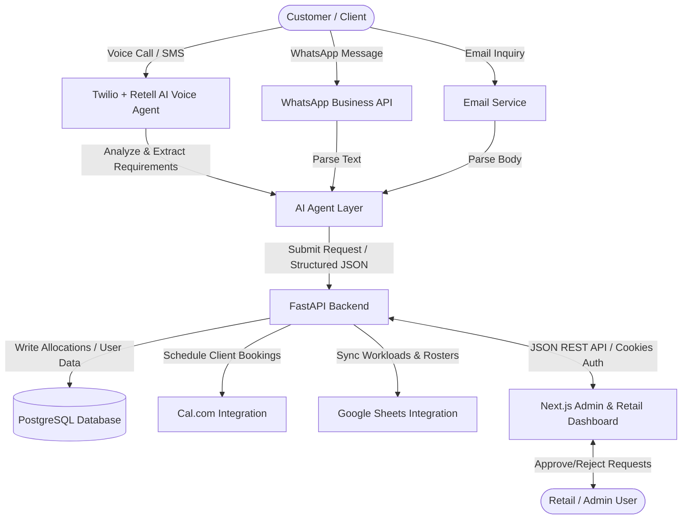

# Architecture Guide: DevMatch AI

This document provides a high-level view of the DevMatch AI communication and data architecture.

## System Flow Diagram

## Architectural Components

1. **Client Intake Channels:** Multi-modal intake (Voice via Retell, SMS/WhatsApp, Email) handles incoming customer inquiries.
2. **AI Processing Agent:** Interprets customer requests to identify target skills (AI/ML, DevOps, Automation) and developer profiles.
3. **Backend Service (FastAPI):** Central business logic engine enforcing client limits (max 2 active clients per developer) and security.
4. **Data & Synchronization Layer:**
   - **PostgreSQL 16:** Main source of truth database.
   - **Google Sheets:** Read/write developer availability mapping.
   - **Cal.com:** External scheduler for calls.
5. **Dashboard Interface (Next.js):** Provides a visual management tool for admin staff to oversee allocation recommendations, manually override, and manage settings.
