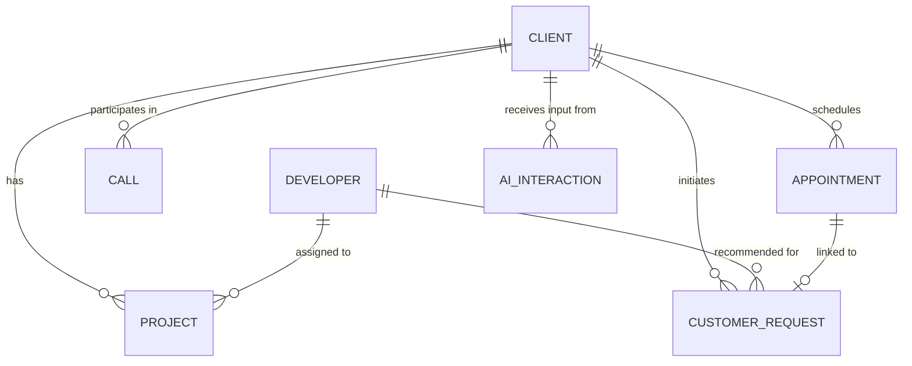

# Database Guide: DevMatch AI

PostgreSQL 16 serves as the primary system of record (main database) for DevMatch AI. The backend uses SQLAlchemy 2.0 (Async) as the Object-Relational Mapper (ORM), AsyncPG as the database driver, and Alembic for schema migrations.

---

## 1. Database Roles & Technologies

- **PostgreSQL 16**: The central relational database. It stores the source of truth for all entities.
- **SQLAlchemy 2.0 Async**: Allows the FastAPI backend to interact with the database using Python objects and asynchronous queries, optimizing resource usage under high concurrency.
- **AsyncPG**: A high-performance, asynchronous PostgreSQL driver for Python.
- **Alembic**: A database migration tool that tracks incremental updates to the database schema, ensuring database consistency across different environments.

---

## 2. Communication Workflow

FastAPI communicates with PostgreSQL using the following steps:
1. **Engine**: An asynchronous engine (`create_async_engine`) is initialized in `backend/app/db/session.py` using the `DATABASE_URL` environment variable.
2. **Session**: An `async_sessionmaker` creates short-lived, async sessions for database operations.
3. **Dependency Injection**: FastAPI endpoints inject a database session using the `get_db` dependency. This ensures that every request gets its own session and cleanly releases/closes it when the request is done.

---

## 3. Database Schema Design (Phase 2 Tables)

Every table uses **UUID primary keys** consistently and **timezone-aware timestamps** for tracking creation and modification times.

### Tables & Fields

1. **`developers`**
   - `id` (UUID, Primary Key)
   - `name` (String)
   - `email` (String, Unique Index)
   - `phone` (String, Nullable)
   - `role` (Enum: `AI_ML`, `AUTOMATION`, `DEVOPS`)
   - `created_at` (DateTime with timezone)
   - `updated_at` (DateTime with timezone)

2. **`clients`**
   - `id` (UUID, Primary Key)
   - `name` (String)
   - `company` (String)
   - `email` (String, Unique Index)
   - `phone` (String, Nullable)
   - `requirement` (Text)
   - `required_role` (Enum: `AI_ML`, `AUTOMATION`, `DEVOPS`)
   - `status` (String)
   - `created_at` (DateTime with timezone)
   - `updated_at` (DateTime with timezone)

3. **`projects`**
   - `id` (UUID, Primary Key)
   - `client_id` (UUID, Foreign Key referencing `clients.id`, cascade on delete)
   - `developer_id` (UUID, Foreign Key referencing `developers.id`, cascade on delete)
   - `name` (String)
   - `status` (String)
   - `created_at` (DateTime with timezone)
   - `updated_at` (DateTime with timezone)

4. **`calls`**
   - `id` (UUID, Primary Key)
   - `client_id` (UUID, Foreign Key referencing `clients.id`, cascade on delete)
   - `call_time` (DateTime with timezone)
   - `call_outcome` (String, Nullable)
   - `call_summary` (Text, Nullable)
   - `created_at` (DateTime with timezone)

5. **`appointments`**
   - `id` (UUID, Primary Key)
   - `client_id` (UUID, Foreign Key referencing `clients.id`, cascade on delete)
   - `appointment_time` (DateTime with timezone)
   - `status` (String)
   - `external_booking_id` (String, Nullable; references Cal.com)
   - `created_at` (DateTime with timezone)
   - `updated_at` (DateTime with timezone)

6. **`ai_interactions`**
   - `id` (UUID, Primary Key)
   - `client_id` (UUID, Foreign Key referencing `clients.id`, cascade on delete)
   - `customer_input` (Text)
   - `ai_response` (Text)
   - `created_at` (DateTime with timezone)

7. **`customer_requests`**
   - `id` (UUID, Primary Key)
   - `client_id` (UUID, Foreign Key referencing `clients.id`, cascade on delete)
   - `required_role` (Enum: `AI_ML`, `AUTOMATION`, `DEVOPS`)
   - `recommended_developer_id` (UUID, Foreign Key referencing `developers.id`, set null on delete)
   - `appointment_id` (UUID, Foreign Key referencing `appointments.id`, set null on delete)
   - `approval_status` (Enum: `PENDING`, `APPROVED`, `REJECTED`)
   - `created_at` (DateTime with timezone)
   - `updated_at` (DateTime with timezone)

---

## 4. Entity Relationships



- **Client**: Has multiple projects, calls, appointments, AI interactions, and customer requests.
- **Developer**: Can be assigned to multiple projects, and suggested in customer requests.
- **Project**: Connects a single Client to a single Developer.
- **Customer Request**: Connects a Client, a recommended Developer, and an Appointment together for admin/retail approval workflows.

---

## 5. Schema Migrations (Alembic)

Migrations track and apply changes to the database structure safely.

### Running Migrations
To bring the database to the latest schema version:
```bash
docker compose exec backend alembic upgrade head
```

### Creating a New Migration
When you modify or add any SQLAlchemy models, generate a new migration script:
```bash
docker compose exec backend alembic revision --autogenerate -m "description of changes"
```
Then run `upgrade head` to apply it.
